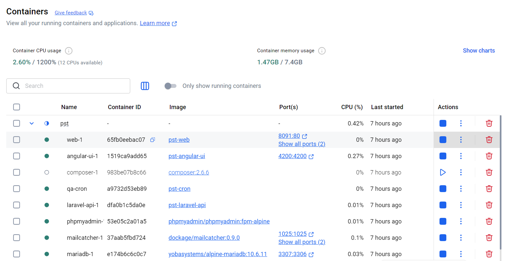
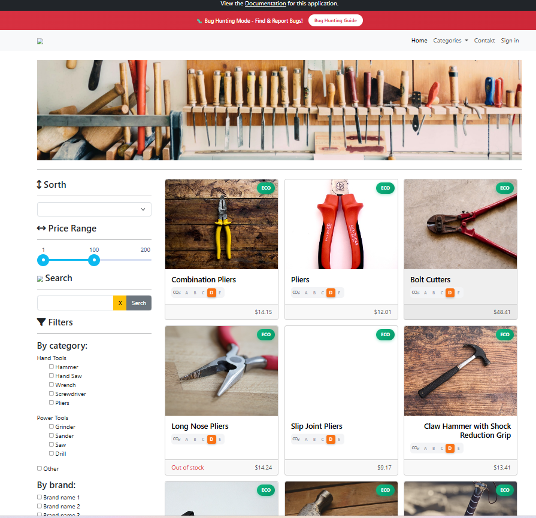
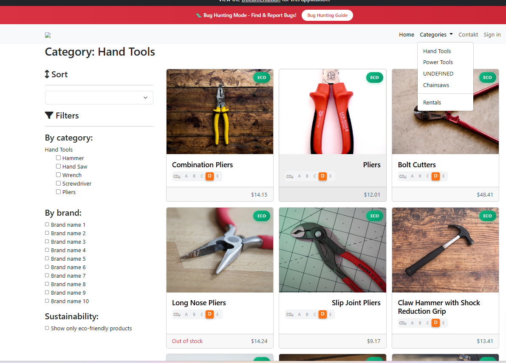
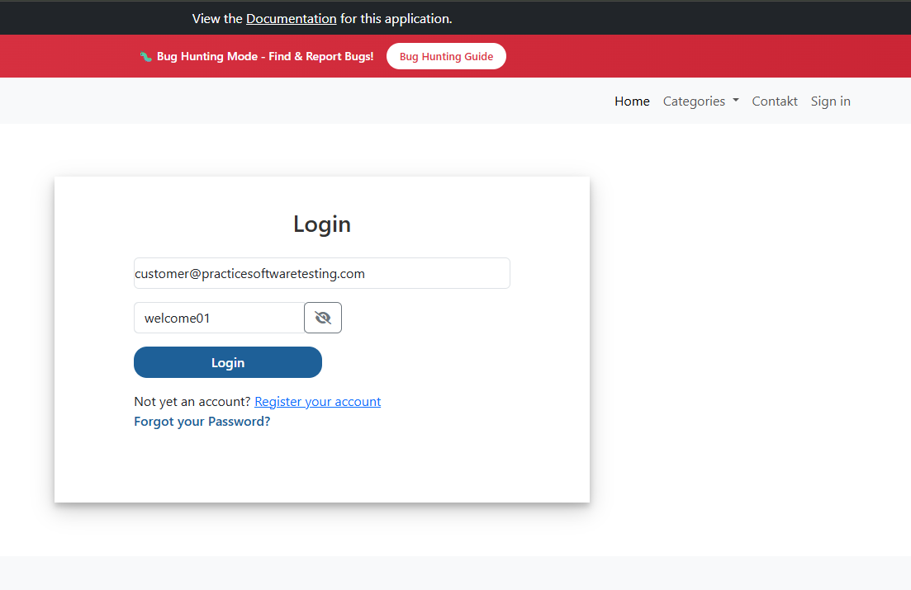
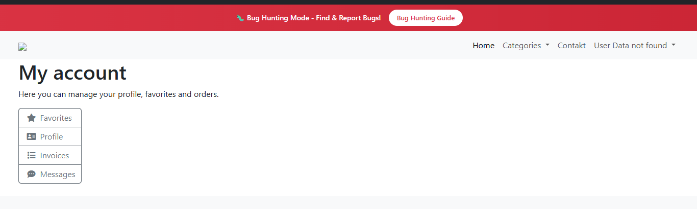
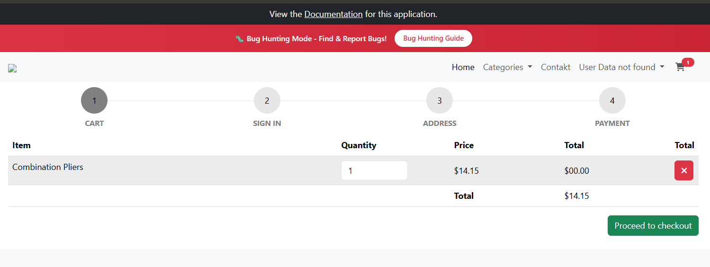
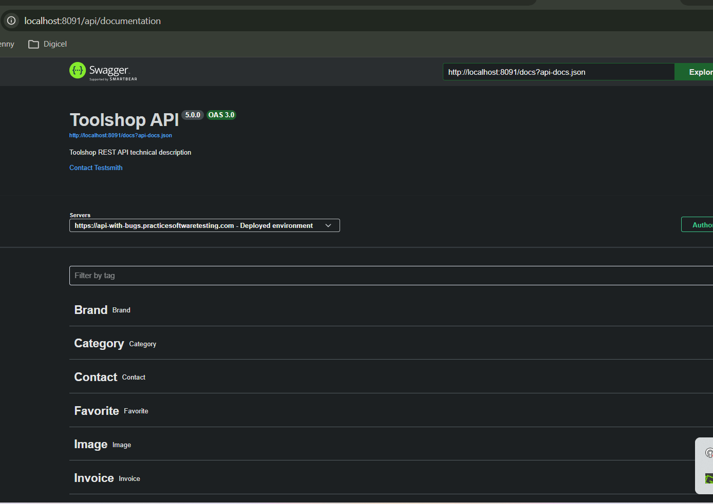

# Pruebas de Humo (Smoke Test)

## 1. Información General
* **Nombre del Proyecto:** Plan de pruebas -- Toolshop
* **Versión / Build:** Versión 1.0
* **Fecha de Ejecución:** 14/09/2026
* **Responsable / QA:** Jenny Sofía Morales López
* **Entorno:** Entorno de QA

---

## 2. Casos de Prueba

| ID | Módulo / Componente | Acción | Resultado esperado | Resultado obtenido | Estado | Evidencia |
|---|---|---|---|---|---|---|
| SM-01 | Infraestructura | Ejecutar `docker compose ps`. | Los servicios aparecen en estado `Up`. | Los contenedores requeridos estaban activos. | Pass | [EV-SM-01](#evidencia-sm-01) |
| SM-02 | Catálogo | Abrir la página principal. | Se muestra el catálogo. | La página cargó y mostró los productos. | Pass | [EV-SM-02](#evidencia-sm-02) |
| SM-03 | Navegación | Abrir una categoría y un producto. | Las vistas cargan sin errores. | [Completar] | Pendiente | [EV-SM-03](#evidencia-sm-03) |
| SM-04 | Autenticación | Iniciar sesión con datos válidos. | El usuario queda autenticado. | [Completar] | Pendiente | [EV-SM-04](#evidencia-sm-04) |
| SM-05 | Carrito | Agregar un producto. | El producto aparece en el carrito. | [Completar] | Pendiente | [EV-SM-05](#evidencia-sm-05) |
| SM-06 | API | Abrir Swagger y consultar la API. | Swagger y la API responden. | [Completar] | Pendiente | [EV-SM-06](#evidencia-sm-06) |
---
### Evidencia SM-01

* **Código:** EV-SM-01
* **Caso relacionado:** SM-01
* **Descripción:** Estado de los contenedores obtenido .
* **Fecha:** 16/09/2026
* **Resultado observado:** Contenedores conrriendo correctamente
* **Archivo:** `EV-SM-01_contenedores_activos.png`

### Evidencia SM-02

* **Código:** EV-SM-02
* **Caso relacionado:** SM-02
* **Descripción:** Verificación de la carga de la página principal y del catálogo.
* **Fecha:** [fecha real]
* **Resultado observado:** La página principal cargó correctamente y mostró los productos disponibles en el catálogo.
* **Estado:** Pass
* **Archivo:** `EV-SM-02_catalogo_productos.png`

### Evidencia SM-03

* **Código:** EV-SM-03
* **Caso relacionado:** SM-03
* **Descripción:** Navegación desde una categoría hacia el detalle de un producto.
* **Fecha:** [fecha real]
* **Resultado observado:** La categoría y el detalle del producto cargaron correctamente, sin errores 404 ni pantallas en blanco.
* **Estado:** Pass
* **Archivo:** `EV-SM-03_detalle_producto.png`

### Evidencia SM-04

* **Código:** EV-SM-04
* **Caso relacionado:** SM-04
* **Descripción:** Inicio de sesión mediante credenciales válidas.
* **Fecha:** [fecha real]
* **Resultado observado:** El sistema autenticó correctamente al usuario y mostró la sesión activa.
* **Estado:** Pass
* **Archivo:** `EV-SM-04_inicio_sesion.png`

### Evidencia SM-05

* **Código:** EV-SM-05
* **Caso relacionado:** SM-05
* **Descripción:** Adición de un producto al carrito de compras.
* **Fecha:** [fecha real]
* **Resultado observado:** El producto fue agregado y el carrito mostró su nombre, cantidad, precio y total.
* **Estado:** Pass
* **Archivo:** `EV-SM-05_producto_carrito.png`

### Evidencia SM-06

* **Código:** EV-SM-06
* **Caso relacionado:** SM-06
* **Descripción:** Verificación de disponibilidad de Swagger y consulta del catálogo mediante la API.
* **Fecha:** [fecha real]
* **Resultado observado:** Swagger cargó correctamente y la API respondió con estado HTTP 200.
* **Estado:** Pass
* **Archivo:** `EV-SM-06_api_swagger.png`

## 3. Resumen y Criterios de Aprobación
* **Total de Pruebas:** 4
* **Aprobadas (Pass):** 2
* **Fallidas (Fail):** 1
* **Bloqueadas / Pendientes:** 1
* **Decisión Final:** **RECHAZADO** (La compilación no es estable para pasar a la fase de pruebas funcionales profundas debido a fallos críticos en la API).
